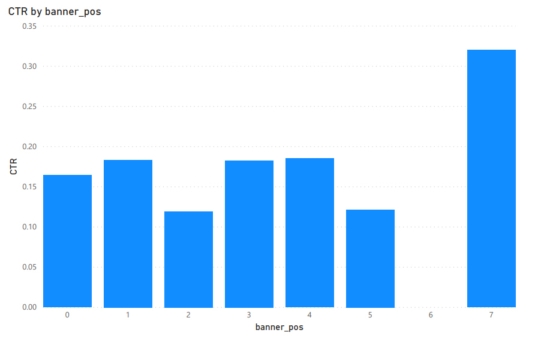
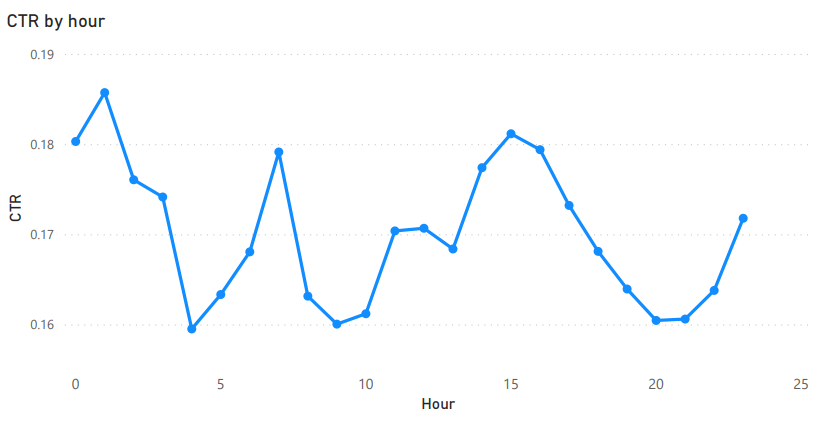

# Advertising Analytics ETL
Displayed advertising ad data to showcase the most effective banner positions and the best dates/hours to run ads to customers

# Introduction & Goals
- Our goals is to find an effective method to store 40 million rows of data (6gb), and read/transform the data
- Tools used:
  - We are working with a .csv file for ad data
  - The tools involved are: Azure blob (storage), Databricks (analytics), and PowerBI (display)

# The Data Set
- Data type: 
  - .csv file
  - This is a flat file of the results of mobile advertising data
- Benefits of the data? 
  - Optimizing ads will save money and generate more revenue if the ad banners are placed in the optimal position at the best times of the day.
- What is problematic? 
  - The file is too large to query without big data tools
- What do you want to do with it? 
  - We want to transform the data to view ad placement results and the click through rate vs time of day

# Used Tools
- Azure blob storage
  - Blob storage allows the large .csv file to be uploaded in block size. It can be easily accessed and read with Databricks
- Databricks
  - The Databricks platform integrates with Azure as a first party service. This simplified platform allows for minimal steps to transform the data
- How did you setup the tools?
  - On my Azure account, I setup a new container with Blob storage. I increased my max blob upload size to reduce the time to upload 6GB of .csv data.
  - For Databricks, I created a cluster and a Scala notebook. 

# Source Code
- Used Scala, Spark, and Spark SQL
  - For source code with comments: select folder 'sources' -> 'advertising_analytics.scala'

# Results
- When comparing the banner position with the click through rate (banner_position.csv), banner position '7' was clearly the most effective with a 0.3201% click through rate. This is almost doubled from all the other banner positions

- For hour vs CTR comparison (hour_ctr.csv), hour 01 and 015 were the highest at 0.185% and 0.181% respectively.  However, the lowest CTR was %0.16, a %.02 difference.

# Conclusion
- The results clearly show the optimal position for the banner and the best times of the day to run ads to customers. Since there are 40 million rows of data, it's clear that using the proper data store with big data analytics tools is the best solution to view important results. The Databricks and Azure platform provides a seamless method to efficiently interpret data.
